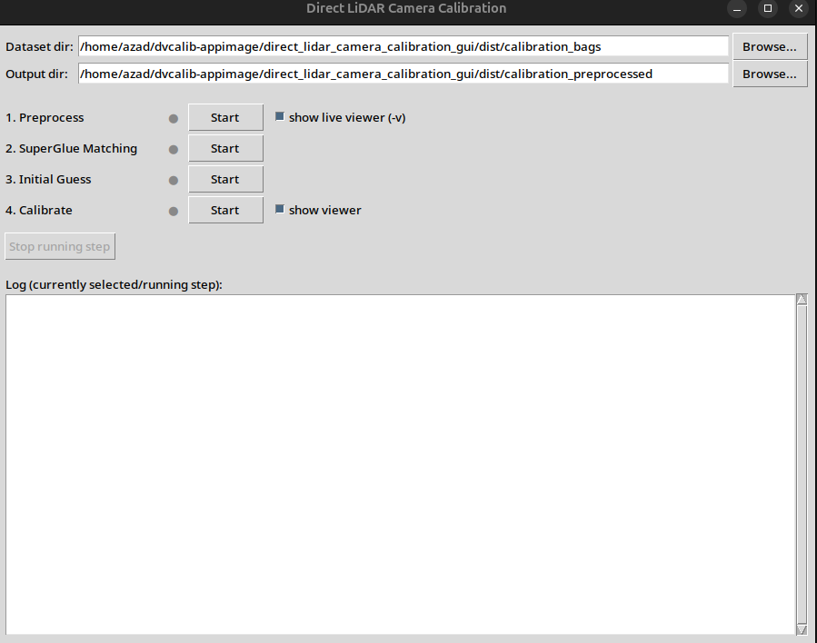
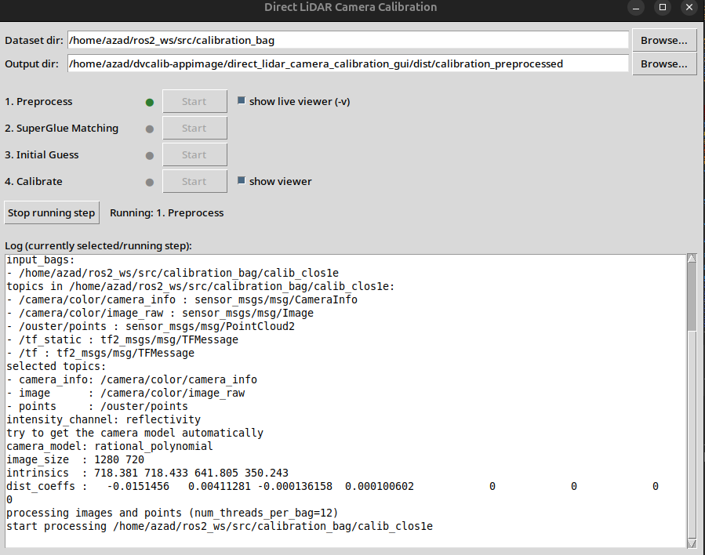
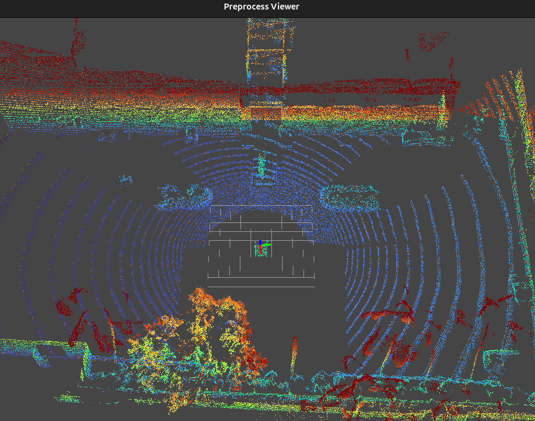
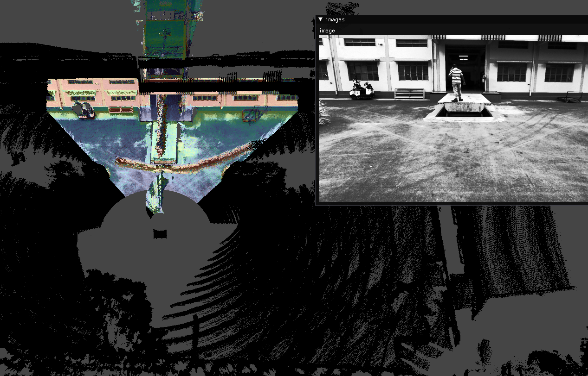
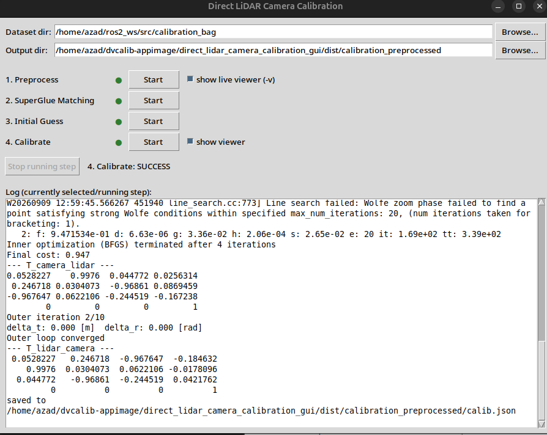

# Direct LiDAR–Camera Calibration — User Guide

> This is the Markdown edition of the guide. A print/PDF edition with the same content
> is available at [`Camera_LiDAR_Calibration_User_Guide.pdf`](Camera_LiDAR_Calibration_User_Guide.pdf).

## What This Application Does

This application calibrates a camera and a LiDAR sensor mounted on the same robot or vehicle —
that is, it works out the precise position and orientation of the camera relative to the LiDAR.
This calibration is required before the two sensors' data can be combined (for example, to color
a LiDAR point cloud using the camera image, or to project LiDAR points onto the camera view).

You do not need to write any code or use a terminal. Everything is done through a single window
with four buttons, one for each step of the calibration process.

The only thing you need to provide is a short recording ("bag") of the camera and LiDAR looking
at the same scene at the same time.

---

## Getting Started

### Requirements
- A 64-bit Linux computer
- Your recorded data (see [Preparing Your Data](#preparing-your-data) below)

### Running the Application

1. Locate the application file — it will have a name like
   `direct-lidar-camera-calibration-<jazzy/bionic/other version>-x86_64.AppImage`.
2. Make sure it's marked as runnable. If you're using a file manager, right-click the file →
   **Properties** → **Permissions** → check **"Allow executing file as program."** If you're using
   a terminal:
   ```bash
   chmod +x direct-lidar-camera-calibration-jazzy-x86_64.AppImage
   ```
3. Double-click the file (or run it from a terminal: `./direct-lidar-camera-calibration-jazzy-x86_64.AppImage`).

The application window opens directly — there's nothing to install.

<p align="center">
  
</p>

---

## Preparing Your Data

The application reads **rosbag2** recordings — the standard recording format used in robotics.
Each recording (each "bag") should contain, at minimum:

- A camera image topic
- A LiDAR point cloud topic
- A camera info topic

You can provide **one or more** bag recordings. More recordings from different viewpoints
generally produce a more accurate calibration.

Put all your bag folders inside a single folder — for example:

```
my_calibration_data/
├── bag1/
├── bag2/
└── bag3/
```

You'll point the application at the `my_calibration_data` folder (the one containing the bag
folders), not at an individual bag.

> **Tip:** If a folder named `calibration_bags` sits right next to the application file, it will
> be picked automatically as the default Dataset directory — you can just drop your bags in there
> and skip typing a path.

---

## The Main Window

| Area | What it's for |
|---|---|
| **Dataset dir** | The folder containing your bag recordings (see above). Use **Browse…** to pick it, or type the path directly. |
| **Output dir** | Where the application writes its results. It's created automatically if it doesn't exist — you don't need to create it yourself. |
| **1. Preprocess / 2. SuperGlue Matching / 3. Initial Guess / 4. Calibrate** | The four steps of the calibration, explained one by one below. Each has its own **Start** button and a status dot next to it. |
| **Status dot** | Shows the state of that step: **grey** = not started yet, **green** = running now (or finished successfully), **red** = failed, or was stopped. |
| **show live viewer (-v)** / **show viewer** | Checkboxes next to steps 1 and 4. When checked, a separate window pops up showing a live 3D view while that step runs (see [About the Viewer Windows](#about-the-viewer-windows)). |
| **Stop running step** | Cancels whichever step is currently running. |
| **Log** | Shows the live text output of whichever step you most recently started — useful for seeing progress, or for understanding what went wrong if a step fails. |

You can click any of the four **Start** buttons at any time, in any order — but only one step runs
at a time; the others stay disabled (greyed out) while something is running.

---

## Step-by-Step: Running a Calibration

1. **Set the Dataset directory** to the folder containing your bag recordings, and the **Output
   directory** to wherever you want the results saved (or just leave the defaults).

2. **Click "Start" next to "1. Preprocess."**
   This step reads your bag recordings and extracts images and dense point clouds from them.
   - If **"show live viewer"** is checked, a separate window will pop up showing the point cloud
     being built up live. This is normal — leave it be, it will close on its own when the step
     finishes.
   - This is typically the slowest step — depending on how much data you recorded, it can take
     anywhere from under a minute to several minutes. Watch the status dot: it turns **green**
     once this step succeeds.

   <p align="center">
     <br/>
     
   </p>

3. **Click "Start" next to "2. SuperGlue Matching."**
   This step finds matching features between the camera image and the LiDAR data. Usually quick.

4. **Click "Start" next to "3. Initial Guess."**
   This step computes a rough first estimate of the camera-to-LiDAR alignment from those matches.
   Usually quick.

5. **Click "Start" next to "4. Calibrate."**
   This is the fine-tuning step — it refines the rough estimate into the final, accurate
   calibration. It's usually the second-slowest step (can take a few minutes).
   - If **"show viewer"** is checked, a window pops up showing the LiDAR points overlaid on the
     camera image, updating live as the calibration improves. This is the best way to visually
     confirm the result looks correct — the LiDAR points should line up with edges and objects
     visible in the camera image.

   <p align="center">
     
   </p>

6. **Wait for the status dot next to "4. Calibrate" to turn green.** The calibration is now
   complete.

   <p align="center">
     
   </p>

---

## Where to Find Your Result

Once step 4 finishes successfully, open your **Output directory** and look for a file named
**`calib.json`**. This file contains the final calibration result, under a field named
`T_lidar_camera` — the transform describing the camera's position and orientation relative to the
LiDAR. This is the file you hand off to whatever downstream system needs the calibration (you
won't normally need to open or edit it yourself).

---

## About the Viewer Windows

Steps 1 and 4 can each open their own separate window showing a live 3D visualization. These are
**separate from the main application window** — this is expected behavior, not an error. You can:
- Leave them alone and let them run/close automatically, or
- Move them out of the way while you keep an eye on the main window and its Log area.

If you'd rather not see these pop-up windows at all, just uncheck **"show live viewer (-v)"** /
**"show viewer"** before starting that step.

---

## If Something Goes Wrong

- **A status dot turns red:** the step failed. Look at the **Log** area — it shows the live
  output from that step, including any error message. Each step also writes a full log file into
  `<your output directory>/logs/`, in case you want to look more closely or send it to support.
- **Common causes of failure:**
  - The Dataset directory doesn't actually contain any valid bag recordings.
  - The bags don't contain the expected camera/LiDAR topics.
  - You started a later step (e.g. "Calibrate") before an earlier one (e.g. "Preprocess") had
    actually finished successfully.
- **A step seems stuck:** some steps can genuinely take several minutes — check the Log area for
  signs of ongoing activity before assuming it's frozen. If you do want to cancel it, click
  **"Stop running step."**

---

## Good to Know

- You can re-run any step as many times as you like — for example, if step 4's result doesn't
  look right in the viewer, just click "Start" on it again (or go back and re-run an earlier step
  first).
- The four steps are meant to be run in order (1 → 2 → 3 → 4) for a normal calibration, but the
  application doesn't force this — you're free to re-run an individual step on its own.

---

## Running Without the AppImage (Developers)

If you built the ROS 2 workspace from source instead of using a packaged AppImage, launch the
same GUI directly:

```bash
source /opt/ros/jazzy/setup.bash
source ~/ros2_ws/install/setup.bash
python3 gui/calibration_gui.py
```

or drive the whole pipeline headlessly from the command line with [`app/run_pipeline.sh`](../app/README.md).
